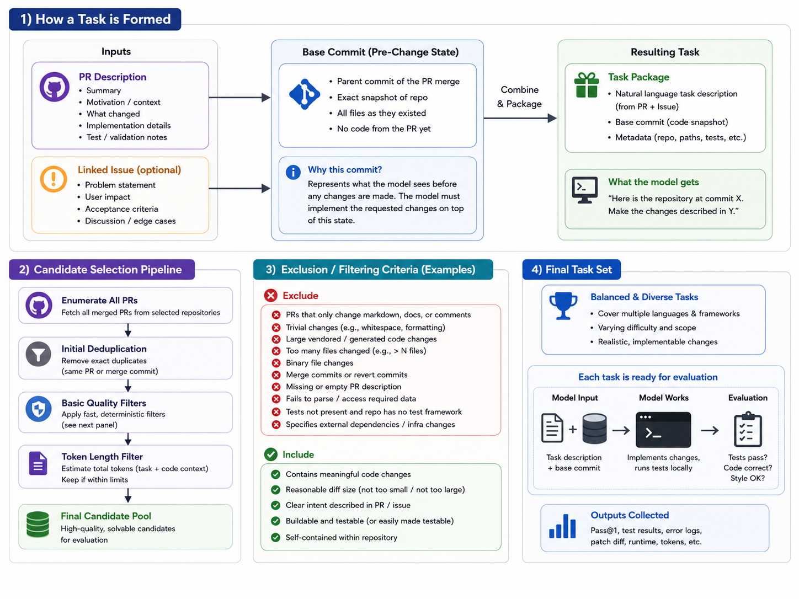

# An Unsaturated Coding-Agent Benchmark for Ruff

## Abstract

This project develops a coding-agent benchmark from recent merged pull requests
in [Ruff](https://github.com/astral-sh/ruff), a Python linter and formatter
implemented primarily in Rust. The benchmark targets 100 automatically
verifiable maintenance tasks. Each task is dynamically validated by requiring
the relevant tests to pass at the base commit, evaluator-owned regression tests
to fail before the fix, and those tests to pass after applying the original
developer patch. Three models are evaluated using the mini-swe-agent harness in
isolated environments, and their submitted patches are assessed by an automated
scoring pipeline. **[Add the final model results and main conclusion after the
evaluation is complete.]**

## 1. Introduction

### 1.1 Motivation and Research Question

Evaluating model capabilities, including comparing models with one another, is
important when selecting a model for a particular task. Some models may perform
well on coding tasks, while others may be better suited to vision or other
modalities. Existing coding-agent benchmarks such as SWE-bench provide a
consistent way to measure coding performance, but new tasks are needed as
models improve and existing benchmarks become less diagnostic.

Open-source projects are a useful source of new coding tasks because their issue
descriptions, pull requests, developer patches, and regression tests provide
evidence that a problem is both realistic and verifiable. This project explores
whether those artifacts can be converted into a reproducible, automatically
scored coding-agent benchmark: **can we generate a coding benchmark from an
open-source repository whose tasks can be automatically validated and scored?**

### 1.2 Contributions

This project makes the following contributions:

1. A benchmark of 100 recent, real-world maintenance tasks mined from merged
   Ruff pull requests and screened against known public benchmark tasks, to ensure the same PRs in other benchmarks are not reused.
2. A reproducible construction and validation pipeline that separates
   developer solutions from evaluator-owned tests and verifies each task
   through base-pass, tests-only-fail, and gold-patch-pass outcomes.
3. An automated evaluator that checks submitted patches for compilation,
   hidden-test correctness, regression-test compilation, formatting, and
   evaluator-file tampering.
4. An empirical comparison of three coding models using a shared
   mini-swe-agent configuration, including correctness, runtime, and cost
   measurements.

## 2. Repository and Task Source

### 2.1 Repository Selection

In order to successfully choose a repository for this task, I wanted to choose a repository which was sufficiently large enough to mine enough verifiable tasks, but at the same time was not used extensively in existing benchmarks. This would allow for a large enough dataset to generate an eval set of desired size, while making sure the tasks are not in the model's training data itself. 

### 2.2 Pull Request Sampling Window

Pull requests were sampled from the `astral-sh/ruff` GitHub repository using a
configured merge-date window of August 1, 2025 through July 29, 2026. The 
crawl excluded pull requests labeled `ty` at query time because that
subproject was outside the benchmark's Ruff-core scope.

The resulting dataset contained 1,875 merged pull requests. Their observed
merge timestamps ranged from August 28, 2025 through July 29, 2026. For each
pull request, the crawler recorded its title, description, labels, base and head
commits, changed files, and any explicitly linked issues.

### 2.3 Inclusion and Exclusion Criteria

The initial static filter retained a pull request only when it contained both a
supported production change and a separable source of evaluator-owned tests.
Supported production changes were Rust source files or the repository's
`Cargo.toml`, `Cargo.lock`, and `pyproject.toml` files. Test artifacts were
identified from test, fixture, or snapshot paths; Rust test-file naming
conventions; and snapshot files. Documentation, automation, and repository
metadata could accompany an otherwise eligible change, but those files were
not included in either the production or test patch.

Candidates were excluded when any of the following conditions applied:

- the pull request touched an out-of-scope path such as `playground/`, `ty/`,
  `crates/ty_`, or `crates/red_knot`;
- it lacked a supported production change or a separable test, fixture, or
  snapshot;
- it contained a changed path that could not be classified as production,
  test, ignored, or explicitly excluded;
- it changed fewer than 2 or more than 1,500 total lines, more than 30 files,
  or more than 20 production files;
- it carried a `dependencies` or `release` label, or its title indicated a
  release, dependency upgrade, or version bump;
- its production and test changes could not be split into two nonempty patches;
- its scrubbed task prompt was shorter than 40 or longer than 12,000
  characters; or
- its pull request, base commit, prompt, or production patch overlapped a known
  public benchmark record.

A second static-triage stage inspected the separated patches more closely. It
rejected candidates when the production and test patches modified the same
file, when executable test registration remained in the production patch, when
new fixtures or snapshots lacked an executable registration, or when no
recognized test signal was present. The surviving candidates were ranked using
test executability, subsystem, patch size, and the availability of a focused
test command. Final inclusion additionally required the dynamic
base-pass, tests-only-fail, and gold-patch-pass outcomes described in
Section 4.

### 2.4 Public Benchmark Decontamination

Candidates were screened against SWE-Bench Multilingual's `astral-sh/ruff` records (matched on PR number, base commit, prompt hash, and patch hash) and excluded on any match, removing 7 overlapping pull requests.

## 3. Benchmark Construction



**Figure 1.** Overview of the benchmark construction pipeline. Panel 1 shows how
a single task is formed from a pull request's description and (optional)
linked issue, combined with the pre-change base commit, into a task package.
Panel 2 shows the candidate selection pipeline from PR enumeration through
deduplication, quality filters, and token-length filtering. Panel 3 lists
representative exclusion and inclusion criteria applied during filtering.
Panel 4 shows how the final, balanced task set is assembled and evaluated
(model input, agent work, and evaluation).

### 3.1 Task Formulation

Each benchmark task asks an agent to modify Ruff at the state immediately
before a selected pull request was applied. The agent is given the reported
problem and the repository, but the artifacts used to validate and score its
solution remain under evaluator control.

```text
Agent receives
├── Natural-language task prompt
└── Ruff repository at the pull request's base commit
    └── Includes tests already present at that commit

Agent produces
└── A source-code patch

Evaluator adds
├── The model's patch
└── Hidden tests.patch

Evaluator runs
└── Compilation, hidden behavior, regression, and formatting checks
```

#### 3.1.1 Agent Input

The agent receives a natural-language prompt derived from the linked issue or
pull request and the complete Ruff repository checked out at the pull request's
base commit. The repository includes all source files and tests that existed at
that commit. The agent can inspect files, edit source code, and run available
commands through a terminal in an isolated container. It does not receive the
new regression tests introduced by the resolving pull request.

#### 3.1.2 Agent Output

The agent must produce a unified Git diff containing its proposed source-code
changes. The benchmark runner extracts this diff from the agent's final
submission marker and saves it as `patch.diff`. The agent is not required to
reproduce the original developer's implementation; any patch satisfying the
evaluator is acceptable.

#### 3.1.3 Evaluator-Only Artifacts

Each task includes artifacts that are retained by the evaluator and are not
provided to the agent:

- `tests.patch` contains the tests, fixtures, and snapshots introduced by the
  original pull request. These artifacts test whether a submitted patch fixes
  the targeted behavior.
- `gold.patch` contains the original developer's production-code changes. It
  is used to prove that the task is solvable during dynamic validation, but it
  is not applied when scoring a model submission.
- The effective test commands, scoring specification, validation results, and
  source metadata remain under evaluator control unless explicitly included in
  the scrubbed task prompt.

Separating these artifacts prevents an agent from copying the original solution
or directly editing the hidden checks. It also allows alternative
implementations to receive credit when they satisfy the same behavioral
requirements.

#### 3.1.4 Success Criterion

A submission is fully resolved when its patch is nonempty, applies cleanly to
the base repository, does not modify evaluator-owned paths, passes the
compilation gate, and passes all hidden behavior, regression, and formatting
checks. A fully resolved task receives a score of `1.0`. The evaluator may award
partial credit when the compilation gate passes but only a subset of the scored
checks succeeds.

### 3.2 Candidate Collection

Candidate collection converted the fetched pull requests into task artifacts
through the following procedure:

1. **Collect pull request metadata.** The crawler fetched 1,875 merged pull
   requests and recorded their descriptions, linked issues, commits, labels,
   and changed files.
2. **Classify the pull request.** The pipeline applied the path, change-size,
   label, title, and known-public-benchmark criteria from Section 2.3.
3. **Construct and check task artifacts.** For each survivor, the pipeline
   checked that the base and head commits were available, generated a scrubbed
   prompt, wrote production changes to `gold.patch`, and wrote tests, fixtures,
   and snapshots to `tests.patch`. It then applied the remaining prompt,
   nonempty-patch, and public-benchmark prompt/patch overlap criteria. Together,
   these two static steps rejected 1,455 pull requests and retained 420
   candidates.
4. **Perform static triage.** Patch structure and executable-test evidence were
   inspected without running the code. This stage retained 324 eligible
   candidates, of which the 180 highest-ranked candidates formed the dynamic
   validation pool.
5. **Run dynamic validation.** Candidates were executed in Docker until more
   than 100 satisfied the base-pass, tests-only-fail, and gold-patch-pass
   requirements. Within the ranked pool, 103 candidates validated and 11 were
   rejected across 114 completed attempts.
6. **Freeze the benchmark.** The first 100 validated candidates in the
   deterministic ranking were written to the final task index. Model results
   were not used during task selection.

For example, `ruff__ruff-25641`, "Preserve whitespace for Quarto cell option
comments," modified one formatter source file and supplied an integration test,
a formatter fixture, and a snapshot. The pipeline separated those files into
nonempty production and test patches, and the candidate continued to triage
and dynamic validation.

### 3.3 Task Prompt Construction

The prompt comes from one natural-language source, chosen by preference: the
linked issue's title and body if one exists, otherwise the pull request's own
title and body. An issue states the problem from a user's perspective,
independent of the eventual fix, so it is preferred when available. Of the 420
static candidates, 246 (59%) used a linked issue and 174 (41%) fell back to
the PR description; the frozen 100 preserve roughly the same split (59/41).

The chosen text is then scrubbed: implementation-revealing sections
(`Solution`, `Approach`, `Test Plan`, etc.) are removed, PR/commit URLs and
`#123` references are replaced with generic placeholders, commit SHAs are
redacted, and HTML comments are stripped. This keeps the prompt from leaking
the reference implementation or the identity of the resolving PR. Prompts
outside a 40–12,000 character range are rejected.

### 3.4 Production and Test Patch Separation

Every candidate's changed files are partitioned into disjoint production and
test paths. A path counts as a test artifact if it matches a configured
test-directory marker, a Rust `_test`/`_tests` suffix, or a test-related
extension (fixture/snapshot); otherwise it counts as production if it has a
supported source extension or is one of a few auxiliary files (`Cargo.toml`,
`Cargo.lock`, `pyproject.toml`). A path matching neither marks the whole
candidate as unclassified and rejects it, rather than guessing the split.

`gold.patch` (production paths) and `tests.patch` (test paths) are then
diffed independently from the same base→head commit range; both must be
nonempty or the candidate is rejected. This is what lets `tests.patch` stay
hidden from the agent while `gold.patch` proves the task solvable (Section
3.1.3).

### 3.5 Static Filtering

The initial static filter applied the size, path, label, prompt, and
decontamination criteria described in Section 2.3. It operated only on pull
request metadata and generated patches; it did not execute Ruff or determine
whether the tests passed. A pull request was rejected if any exclusion reason
was present. Because one pull request could violate multiple criteria,
individual rejection-reason counts are not mutually exclusive.

As a simple rejection example, `ruff__ruff-27284`, "Update Rust crate serde to
v1.0.229," was excluded because it did not contain a separable test, fixture, or
snapshot. The change therefore could not supply an evaluator-owned behavioral
check. Similarly, `ruff__ruff-26436`, "fix typos," reached the prompt
construction step but was rejected because its scrubbed prompt contained fewer
than 40 characters. In contrast, `ruff__ruff-25641` contained both a supported
Rust production change and separable test artifacts and therefore survived this
stage.

### 3.6 Candidate Ranking and Triage

Static triage examined the contents of the separated patches to estimate whether
the proposed hidden tests would be executable. It checked for registered Rust
tests, existing or newly added fixtures, snapshots, formatter expectations,
file overlap between the two patches, and test registration accidentally left
in the production patch. It also proposed focused Cargo commands based on the
affected crate, test target, module, and newly added test-function names.

Eligible candidates received a priority score favoring direct test
registration, existing behavioral artifacts, small production patches, and
predictable Ruff subsystems. Candidates were then sorted first by eligibility,
then by decreasing priority score, and finally by task identifier. The
top-ranked 180 eligible candidates formed the dynamic pool.

For example, `ruff__ruff-19045` contained useful fixtures and snapshots for
three `flake8-gettext` rules, but the corresponding `#[test_case]`
registrations remained in `gold.patch`. Without the gold patch, those tests
would not be registered, so triage rejected the candidate with
`test_registration_left_in_gold`. Another candidate, `ruff__ruff-20273`,
contained only a newly created snapshot without an independent test
registration and was rejected as
`only_new_unregistered_test_artifacts`. By comparison,
`ruff__ruff-25641` received a priority score of 110 and two focused commands:
the Quarto CLI test and the formatter test suite.

### 3.7 Final Task Selection

Dynamic-validation outcomes were joined back to the deterministic triage
ranking. The final index contains the first 100 records whose saved status was
`validated`; all 100 entries in the frozen index have that status. Three
additional validated candidates remained outside the primary set. This
procedure made the final selection reproducible while avoiding selection based
on whether any evaluated model could solve a task.

## 4. Dynamic Validation

### 4.1 Validation Criteria

Dynamic validation runs each candidate's focused test command(s) in three
clean phases against the pinned base commit: `base` (no patches), `tests_only`
(`tests.patch` only), and `gold` (`tests.patch` then `gold.patch`). A
candidate is `validated` only if all three phases produce the required
outcome; each phase ran once per candidate (`repeats: 1`), with multi-repeat
flakiness checks reserved for after task selection.

#### 4.1.1 Base-Commit Test Outcome

The tests must **pass** unmodified at the base commit — a health check that
the suite isn't already broken or flaky before any hidden test is added.
Failure is rejected as `base_regression_failure` (5 of 114 attempts).

#### 4.1.2 Tests-Only Outcome

With only `tests.patch` applied, the tests must **fail**. This is the
"before" half of fail-to-pass: it proves the hidden test actually exercises
the unfixed bug rather than being vacuous or already satisfied. Failing this
check is rejected as `hidden_tests_do_not_consistently_fail` (2 of 114
attempts).

#### 4.1.3 Gold-Patch Outcome

With `tests.patch` then `gold.patch` applied, the tests must **pass** — the
"after" half of fail-to-pass, proving the task is solvable by the original
fix. Rejected as `gold_patch_apply_failure` if the patch doesn't apply (1 of
114) or `gold_does_not_consistently_pass` if it applies but tests still fail
(9 of 114, the most common dynamic rejection reason).

### 4.2 Validation Environment

Each phase runs in a disposable, network-disabled Docker container
(`--network none`) built from a per-base-commit image, smoke-tested before
use. Patches are applied with `git apply --check` then `git apply` in the
phase's fixed order, against a read-only mount of the staged artifacts.
Containers are capped at 4 CPUs / 8 GB memory with a per-command timeout
(900s default); a timed-out or Docker-level failure is recorded as an
`infrastructure_error`, distinct from a semantic `rejected` outcome, so host
problems are never conflated with candidate failures.

### 4.3 Validation Results

The dynamic validator accepted `ruff__ruff-25641`: its focused commands passed
on the unmodified base, failed after applying `tests.patch`, and passed after
applying both `tests.patch` and `gold.patch`. This is the expected transition
for an executable regression test that is repaired by the original developer
solution.

In contrast, `ruff__ruff-20375`, "Add
`analyze.string-imports-min-dots` to settings," survived both static stages but
was dynamically rejected. Its focused test command passed in the base,
tests-only, and gold phases. Because the evaluator-owned test did not fail
before the solution was applied, the candidate was classified as
`hidden_tests_do_not_consistently_fail` and could not enter the benchmark.

## 5. Agent Evaluation Methodology

### 5.1 Models

Three models were evaluated, all routed through OpenRouter with a shared
model configuration (`drop_params`, `parallel_tool_calls`, `max_tokens: 4096`):

- `qwen/qwen3-coder-next`
- `deepseek/deepseek-v4-flash`
- `openai/gpt-5.4-mini`

### 5.2 mini-swe-agent Configuration

All models were run with mini-swe-agent v2.4.5 using a shared `mini.yaml`
config: `agent_class: AutoSubmitInteractiveAgent` (Section 5.5) in a Docker
environment, `interpreter: [bash, -c]`, and a fixed system/instance prompt
telling the agent to make the smallest production-only edit, leave tests and
evaluator files untouched, avoid full-workspace or `--release` builds, and
submit by echoing a fixed marker followed by `cat`-ing its diff. Limits
(step, cost, wall-time) are covered in Section 5.4.

### 5.3 Agent Inputs and Repository Access

Each task runs in its own Docker image, built once and reused across models:
the Dockerfile fetches the Ruff repository at the task's `base_commit`
(shallow, detached-HEAD checkout) directly into `/testbed`, so the agent
starts from the exact pre-change state with no setup step of its own. Images
are smoke-tested before use and reused when their base-commit and precompile
labels already match. Containers run network-isolated (`--network none`);
required crates are fetched with `cargo fetch --locked` at build time.

Early runs showed that a cold Ruff build could consume most of a task's step
and wall-time budget before the agent made any progress. The fix was to
precompile: the image build runs `cargo test --no-run` for the core crates
(`ruff`, `ruff_linter`, `ruff_python_formatter`, `ruff_python_parser`) ahead of
time, and agent/evaluator containers mount that image's own compiled target
directory directly instead of masking it with an empty volume. The system
prompt also tells the agent not to run full-workspace or `--release` builds,
since the precompiled targets make that unnecessary.

### 5.4 Runtime, Step, and Cost Limits

Each run is capped at 30 steps, $1.00, and 180 seconds of wall time (with a
45-minute outer container timeout as a hard backstop). As either the step or
time budget runs low (≤15 steps or ≤120 seconds remaining), the chat template
injects a warning telling the agent to stop exploring and submit immediately.

### 5.5 Patch Submission and Extraction

Normally, the agent stages its diff and submits by echoing a fixed marker
followed by `cat`-ing the patch, which the runner extracts into `patch.diff`.
In practice, some agents ran out of steps, cost, or time while still
mid-edit and never reached that submission step, silently losing an otherwise
usable fix. To prevent this, the agent runs as `AutoSubmitInteractiveAgent`: on
a step, cost, or time-limit exception, it captures `git diff -- .` before the
container is torn down and, if the tracked-file diff is nonempty, submits it
directly with an `AutoSubmitted<LimitName>` exit status instead of discarding
it.

## 6. Evaluator and Scoring

### 6.1 Patch Application and Tamper Checks

Scoring applies the model's submitted patch to the base commit first, then
applies `tests.patch` on top of it, both with `git apply --check` before
`git apply`. If either fails, the run is a gate failure
(`patch_not_applied`). Before applying anything, the submission is diffed
against `tests.patch` at the file-path level; any overlap is flagged
`evaluator_tampered` and recorded as a `policy_violation`, since it means the
agent edited the hidden tests instead of the production code.

### 6.2 Compilation and Semantic Checks

One gate check must pass before any scored check runs: `cargo check --locked
-p <crate>` for the crate touched by the task. Three scored checks then run,
one per weighted group:

- **core** — the actual tests, fixtures, and snapshots from `tests.patch`,
  run via the task's target test command(s): the same focused command
  validated to fail-before/pass-after the gold patch in Section 4.1. This is
  the only check drawn from the hidden PR-derived tests; it is the direct
  measure of whether the model's patch fixes the targeted behavior.
- **regression** — `cargo test --locked -p <crate> --no-run`, a generic
  compile-only check (unrelated to `tests.patch`) confirming the crate's
  existing test suite still compiles against the model's change.
- **quality** — `cargo fmt --all -- --check`, a generic formatting check
  (also unrelated to `tests.patch`) confirming the patch is cleanly
  formatted.

### 6.3 Score Calculation

Each group has a fixed weight (core 0.80, regression 0.15, quality 0.05; the
scorer also supports an `edge` group, currently unused). A group's score is
its fraction of passing checks within that group, and the raw score is the
weighted sum across groups.

Any gate failure — a failed compile, a failed patch/tests.patch application,
tampering, or a timeout — overrides everything and forces a score of `0.0`.
Otherwise, if the core check fails, the score is capped at 0.20 regardless of
how the other groups scored, so a patch that doesn't fix the targeted
behavior can't earn significant credit from formatting or compilation alone.
A task is `fully_resolved` only at a score of exactly `1.0`.

## 7. Results

### 7.1 Model Performance

### 7.2 Runtime, Cost, and Token Usage

### 7.3 Infrastructure Failures and Retries

## 8. Analysis

### 8.1 Performance by Subsystem and Task Size

### 8.2 Agent Failure Modes

### 8.3 Evidence of Benchmark Unsaturation

## 9. Limitations

**Agent evaluation scale.** Of the 100 frozen tasks, only a 20-task subset was
run to completion across the three models (60 model×task jobs). Even with precompiled images
(Section 5.3), each job still spends real wall-clock time on Cargo's
incremental rebuild and on the test command itself, and multiplying that by
100 tasks × 3 models was not feasible in the time available. The results in
Section 7 should be read as a partial sample, not a resolution rate over the
full benchmark.

**Step-limit bias toward small tasks.** Runs were capped at 30 steps and 180
seconds of wall time (Section 5.4), kept tight largely to make the 20-task
subset in the previous point tractable. A low step ceiling likely biases
completed, non-auto-submitted runs toward tasks that
need little exploration, i.e., smaller patches, and can make a model look
less capable on larger tasks simply because it ran out of turns rather than
because it couldn't solve the task. The auto-submit fallback (Section 5.5)
was added directly because of this constraint — agents were repeatedly
hitting the limit mid-edit — but it only recovers a partial patch already in
progress; it doesn't remove the bias toward tasks solvable in a short budget.

**Limited model roster.** All three evaluated models are relatively small and
fast; no larger frontier model was included, so the results say more about
how budget-constrained, low-cost models perform than about the benchmark's
ceiling.

**Limited dynamic validation.** Each candidate's base/tests-only/gold phases
(Section 4.1) ran once (`repeats: 1`) rather than several times, so a hidden
test that is flaky rather than deterministic could be misclassified as
validated or wrongly rejected. Repeated-phase flakiness checking exists in
the validator but was not run at the scale needed to catch this.

**Shallow issue linking.** Task prompts use only the first linked issue found
for a pull request (Section 3.3); a PR referencing multiple issues, or an
issue only reachable through discussion rather than a structured "Closes #N"
reference, is not considered. Some prompts may therefore omit context a human
maintainer actually had.

## 10. Future Work

**Step and wall-time ablations.** Re-run the same tasks and models while
varying `step_limit` and `wall_time_limit_seconds` (e.g., 30 vs. 60 vs. 120
steps) to measure how much of the resolution rate is capped by budget rather
than model capability, and whether giving more steps closes the gap on larger
tasks predicted by the step-limit bias in Section 9.

**Broader model roster.** Add one or more larger, more expensive models
alongside the three small/fast models evaluated here. Because model choice
was biased toward speed and cost, it is unclear whether low resolution rates
reflect the benchmark's difficulty or the roster's capability ceiling;
comparing against a stronger model would separate the two.

**Multiple independent runs per task** Rather than only 1 independent repeat per task, we can run multiple iterations of each task per model, and take the score as passed under some threshold (pass@k) or simply take the average. This reduces variance across model runs, which as presented in the results are only based on 1 independent build run due to time constraints.

## 11. Reproducibility

### 11.1 Environment and Configuration

The complete benchmark implementation, frozen task set, Dockerfile, agent
configuration, model overlays, and scoring code are included in the submitted
repository. Reproduction requires Python 3.11 or newer, Git, `jq`, and a
running Docker Engine (Docker Desktop is sufficient on macOS). The experiments
reported here used Linux containers with 4 CPUs and 8 GB of memory available
to each agent container. Because Ruff compilation is memory- and
storage-intensive, a host running two task workers should make at least 8 CPUs,
16 GB of memory, and sufficient Docker disk space available. Using fewer
workers changes throughput, but not the tasks or scoring procedure.

From the repository root, create the pinned Python environment with:

```bash
python3 -m venv .venv
.venv/bin/pip install -r requirements.txt
.venv/bin/pip install -r benchmark/requirements.txt
docker version
```

The second requirements file pins mini-swe-agent to version 2.4.5. Model API
calls originate on the host, while every shell command issued by an agent runs
inside a task-specific Docker container. The container has no network access
(`--network none`), no Git remote, and no access to `tests.patch` or
`gold.patch`. Dependencies are downloaded and the relevant Ruff targets are
compiled while the image is built, before network isolation is applied.

OpenRouter authentication can be supplied either through the host environment
or an ignored `.env.local` file:

```bash
export OPENROUTER_API_KEY="<key>"
# Alternatively, put OPENROUTER_API_KEY=<key> in .env.local.
```

The batch runner reads `.env.local` automatically and does not copy the key
into task images or containers. The frozen tasks are listed in
`tasks/index.jsonl`; shared agent limits and container settings are in
`benchmark/mini.yaml`; experiment defaults are in `config.yaml`; and enabled
models are registered in `benchmark/models.yaml`. These files should remain
unchanged during a reportable comparison.

### 11.2 Reproduction Commands

The runner builds or reuses one image for each selected task, runs all selected
models against fresh containers made from that image, extracts each submitted
patch, evaluates it in another clean container, and then removes disposable
resources. A one-task dry run can first be used to verify task and model
selection without building an image or calling an API:

```bash
.venv/bin/python scripts/04_run_benchmark.py \
  --run-id reproduction-check \
  --task-id ruff__ruff-19571 \
  --model deepseek-v4-flash \
  --dry-run
```

Next, the same task can be run end to end. This is the quickest check that a
model receives the prompt and pre-change codebase, produces a patch, and that
the hidden-test scorer returns a result:

```bash
.venv/bin/python scripts/04_run_benchmark.py \
  --run-id reproduction-smoke \
  --task-id ruff__ruff-19571 \
  --model deepseek-v4-flash \
  --workers 1 \
  --step-limit 20 \
  --cost-limit 1.00 \
  --wall-time-limit-seconds 180 \
  --evaluation-timeout 300
```

To reproduce the reported 20-task, three-model experiment (60 model-task
runs), load the predeclared task IDs from `benchmark/subsets/core20.txt` and
run:

```bash
TASK_ARGUMENTS=()
while IFS= read -r task_id; do
  TASK_ARGUMENTS+=(--task-id "$task_id")
done < benchmark/subsets/core20.txt

.venv/bin/python scripts/04_run_benchmark.py \
  --run-id reproduction-core20 \
  --model qwen3-coder-next \
  --model deepseek-v4-flash \
  --model gpt-5.4-mini \
  "${TASK_ARGUMENTS[@]}" \
  --workers 2 \
  --step-limit 30 \
  --cost-limit 1.00 \
  --wall-time-limit-seconds 180 \
  --evaluation-timeout 300

.venv/bin/python scripts/06_summarize_results.py \
  results/runs/reproduction-core20
```

Running the same command without the repeated `--task-id` arguments selects
the complete frozen 100-task benchmark from `tasks/index.jsonl`. The `--workers`
value controls only how many task images are processed concurrently; it can be
reduced on a smaller host without changing benchmark semantics. If a run is
interrupted, the same command can be resumed without repeating completed and
scored model-task pairs by adding `--skip-existing`.

The runner evaluates patches immediately by default. If inference was
deliberately collected with `--skip-evaluation`, it can instead be scored
afterward with:

```bash
.venv/bin/python scripts/04b_evaluate_results.py \
  results/runs/<run-id> \
  --workers 2

.venv/bin/python scripts/06_summarize_results.py \
  results/runs/<run-id>
```

The Docker environment can also be inspected independently of the agent
runner. The following builds the image for one pinned task and executes its
smoke test:

```bash
TASK_ID=ruff__ruff-20777
BASE_COMMIT="$(jq -r .base_commit "tasks/${TASK_ID}/task.json")"

docker build \
  --file environment/Dockerfile \
  --build-arg "RUFF_COMMIT=${BASE_COMMIT}" \
  --build-arg PRECOMPILE=true \
  --tag "mini-unsat-ruff:${TASK_ID}" \
  environment

docker run --rm --network none \
  "mini-unsat-ruff:${TASK_ID}" smoke-test
```

Precompilation makes the image build slower but prevents each model and
evaluator container from paying the same cold Ruff compilation cost. For a
quick environment diagnostic only, `PRECOMPILE=false` may be used; measured
model comparisons should use the same precompilation setting for all tasks and
models.

An existing registered model can be selected with one or more repeated
`--model <id>` arguments. For example, the following runs only Qwen and
DeepSeek:

```bash
.venv/bin/python scripts/04_run_benchmark.py \
  --run-id selected-models \
  --limit 20 \
  --model qwen3-coder-next \
  --model deepseek-v4-flash \
  --workers 2
```

To add another OpenRouter model, create a model overlay such as
`benchmark/models/my-model.yaml`:

```yaml
model:
  model_class: openrouter
  model_name: provider/model-name
  cost_tracking: ignore_errors
  model_kwargs:
    drop_params: true
    parallel_tool_calls: true
    max_tokens: 4096
```

Then add an enabled entry to `benchmark/models.yaml`:

```yaml
models:
  - id: my-model
    config: benchmark/models/my-model.yaml
    api_key_env: OPENROUTER_API_KEY
    enabled: true
```

The model can then be selected with `--model my-model`. For a fair comparison,
the shared prompt, task set, resource limits, step limit, wall-time limit, and
cost limit must remain fixed. The exact provider-returned model identifier
should also be retained because hosted aliases may change over time.

### 11.3 Artifact Layout and Data Handling

Each run is written under `results/runs/<run-id>/`. Its top-level
`manifest.json` records the selected task and model IDs, mini-swe-agent version,
limits, precompilation setting, and hashes of the task index, shared agent
configuration, model registry and overlays, Dockerfile, and setup script. Each
model-task directory contains:

```text
results/runs/<run-id>/
├── manifest.json
├── runs.json
├── scores.json
├── summary.json
├── summary.md
├── subsystem-summary.json
├── pairwise-comparisons.json
└── <model-id>/<task-id>/
    ├── environment.yaml
    ├── trajectory.json
    ├── runner.log
    ├── patch.diff
    ├── run.json
    ├── eval.json
    ├── checks.json
    └── score.json
```

`trajectory.json` and `runner.log` preserve the agent interaction;
`patch.diff` is the submitted model change; `checks.json` records evaluator
outcomes; and `score.json` contains the final score and resolution status.
Infrastructure failures are recorded separately from scorable model failures.
API credentials and `.env.local` are excluded from the artifacts. Reproduction
should retain the complete run directory and `manifest.json`, rather than only
the aggregate summary, so every reported score can be traced back to its model
trajectory, patch, environment, and individual evaluator checks.

## 12. Conclusion
